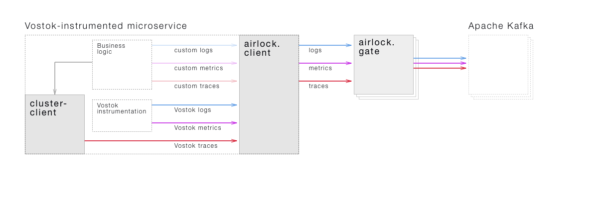

*A complete microservice toolkit for .NET developers.*

Vostok has everything .NET developers need to create distributes systems. It enables intra-cluster interaction between microservices and collects their logs, metrics, and distributes traces out of the box. Vostok supports .NET Core 2.0, .NET WebAPI, and more.

## How it works

Vostok provides instrumentation for microservices and a number of complementary services. Instrumentation is required to collect data which is necessary for any production-ready distributed system:

* logs for application lifecycle
* metrics for resource usage
* traces for intra-cluster interaction

Every Vostok-instrumented microservice collects described data out of the box. No additional confuguration or code is required.

Applications would use provided interfaces to write custom logs and metrics. Any outgoing requests via provided *[Cluster Client](https://github.com/vostok/clusterclient)* would be included to collected distributed traces. These include requests to Vostok-instrumented applications (e.g., other microservices) and non-instrumented applications (e.g., databases or external APIs).



Microservices send all logs, metrics, and traces via their *[Airlock Clients](https://github.com/vostok/airlock.client)* to the *[Airlock Gate](https://github.com/vostok/airlock.client)*. This [ridiculuosly performant](https://github.com/vostok/core/issues/3) service puts received events to Apache Kafka. A swarm of *[Airlock Consumers](https://github.com/vostok/airlock.consumer)* read and process events from Kafka.

Events are either transformed and put back to Kafka, or transferred to backends:

* *Logs* consumer transfer logs to Elasticsearch
* *Metrics Aggregator* calculates aggregated metrics and puts them to Kafka
* *Metrics* consumer transfer metrics to Graphite
* *Traces* consumer transfer traces to Cassandra

Backends store the data and feed it end-user applications. Developers use them to monitor the distributed system as a whole:

* view and search logs in Kibana
* view and plot metrics in Grafana
* view and explore traces in *[Contrails](https://github.com/vostok/contrails)*

## Features

**Feature complete.** Vostok has everything to create, monitor and troubleshoot microservices. No other tools or libraries are required.

**Sanely pre-configured.** Vostok has ready to use templates for your .NET Core and .NET Web API applications as well as Docker files for complementary services. Zero configuration is required to get started.

**Fast by design.** Vostok is benchmarked and optimized for performance and throughput. No expensive hardware is required. Commodity servers are just fine for complementary services.

<br><br>

---

*Everything below this line is work-in-progress.*

<br>

## Getting started

### Run a sample Vostok-enabled application

Run an all-in-one Vostok bundle with Docker. It includes *Airlock Gate*, Kafka, all *Airlock Consumers*, Graphite, Grafana, Elasticsearch, Kibana, Cassandra, and *Contrails*.

```sh
git clone https://github.com/vostok/spaceport.git
cd spaceport
docker-compose up
```

Complementary services would be up and running:

* *Airlock Gate*
* *Airlock Consumers*
* Kibana — navigate to [localhost:5100](http://localhost:5100) to view logs
* Grafana — navigate to [localhost:5200](http://localhost:5200) to view metrics
* Contrails — navigate to [localhost:5300](http://localhost:5100) to view traces

Get a [sample application](https://github.com/vostok/prototype-app). It contains several Vostok-enabled microservices which send logs, metrics, and traces to *Airlock Gate* via their *Airlock Clients*.

```sh
git clone https://github.com/vostok/prototype-app.git
cd prototype-app
./start.sh
```

Navigate to [localhost:5000](http://localhost:5000) to see that it works. You should see its logs in Kibana, metrics in Grafana, and traces in *Contrails*.

### Create your first Vostok-enabled application

Run the all-in-one Vostok bundle, as described above, or setup a [stand-alone Vostok installation](#).

Install *[Launchpad](https://github.com/vostok/launchpad)*, a CLI tool for Vostok.

On Windows, download this [MSI package](#).

On Ubuntu, use Aptitude:

```sh
apt-get install vostok
```

On CentOS, use Yum:

```sh
yum install vostok
```

On macOS, use Homebrew:

```sh
brew install vostok
```

Create and run a .NET Core microservice with Vostok instrumentation:

```sh
vostok create --name "vostok-one-app"
dotnet run
```

Navigate to [localhost:33333](http://localhost:33333) to see that it works. You should see its logs in Kibana, metrics in Grafana, and traces in Contrails.